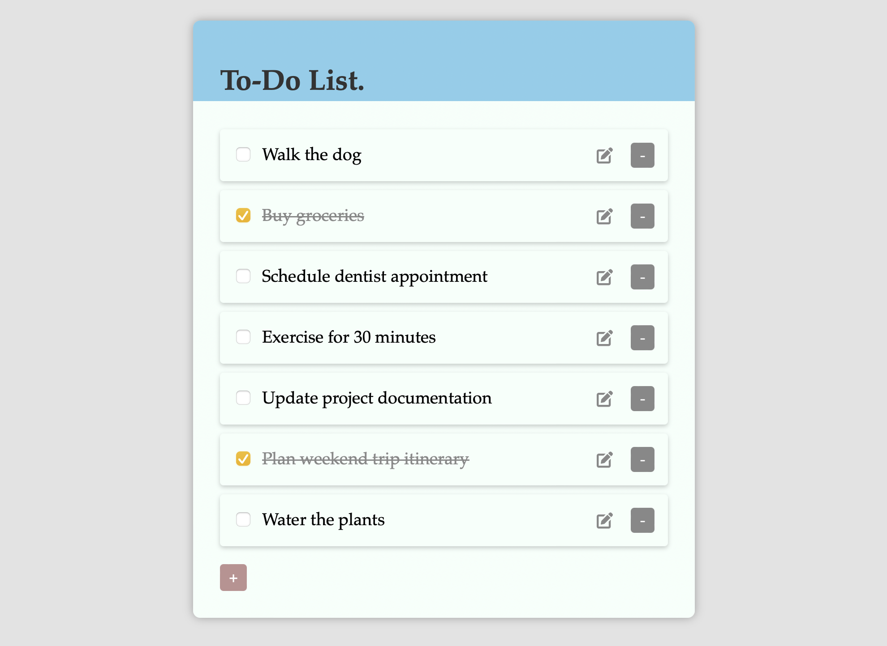

# To-do list app

This repository features a simple To-Do List application built with HTML, CSS, and JavaScript. It serves as a front-end template that is easily customizable and integrable. Additionally, it can be used as an underlying app for deployment in AWS projects, such as static website hosting or as part of larger infrastructure setups.

 

